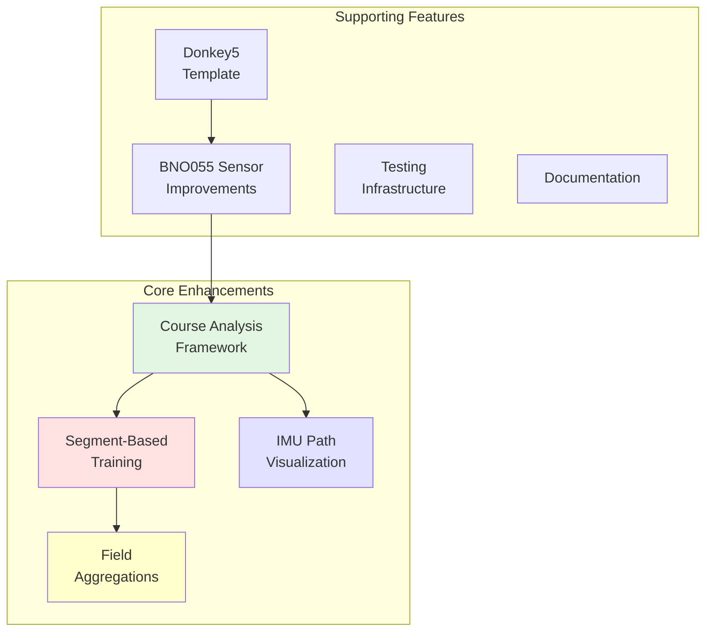
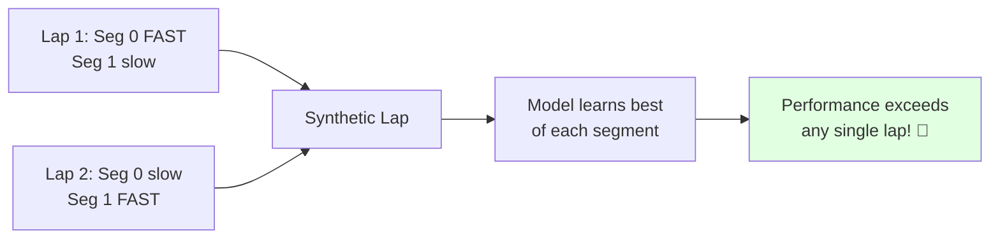

# NEWS - DocGarbanzo Fork Enhancements

This document provides a summary of major differences and enhancements in the 
DocGarbanzo fork compared to the original autorope/donkeycar repository.

**📚 Detailed documentation for each feature is available in separate chapter files** - click the links below for complete information with diagrams and examples.

---

## Overview

This fork extends the Donkey Car platform with advanced course analysis, 
segment-based training, and enhanced IMU sensor capabilities. The focus is on 
improving autonomous driving performance through intelligent data analysis and 
training methodologies.



---

## Major Features

### 1. 🗺️ Course Analysis Framework

> **[📖 Read Full Documentation →](news_01_course_analysis.md)**

A comprehensive system for analyzing recorded driving data and computing geometric track representations.

**Quick Overview:**
- **PathData Container**: Immutable data structure for trajectory information
- **Lap Detection**: Two strategies (YCrossing for clean data, Drift for GPS)
- **Mean Course**: Compute smooth reference course from multiple laps
- **Segmentation**: Four strategies to divide course into meaningful sections
- **Segment Assignment**: Assign segment IDs to driven paths

**Key Benefits:**
- Quantify track geometry (straights, turns, difficulty)
- Enable segment-based training
- Validate IMU data quality
- Visualize and debug trajectories

**Location:** `donkeycar/course_analysis/`

**Architecture Diagram:** See [full documentation](news_01_course_analysis.md) for complete workflow diagrams.

---

### 2. 🎯 Segment-Based Performance Training

> **[📖 Read Full Documentation →](news_02_segment_training.md)**

Revolutionary training methodology that creates "synthetic perfect laps" by combining the best execution of each track segment across all laps.

**The Innovation:**

Traditional training uses the single best complete lap. Segment-based training recognizes that drivers rarely execute every part of a track perfectly in one lap. By training on the best instance of each segment, models can exceed any single human demonstration.



**Quick Workflow:**
1. Record 3-5 laps with IMU enabled
2. Run `donkey segment --tub ./data/tub_1`
3. Enable `SEGMENT_PCT_MODE = True` in config
4. Train model normally

**Typical Results:**
- 3 laps: 2-5% improvement over best lap
- 5 laps: 5-10% improvement  
- 10 laps: 10-15% improvement

**See Full Documentation:** Complete workflow diagrams, configuration guide, and troubleshooting in [news_02_segment_training.md](news_02_segment_training.md).

---

### 3. 📊 IMU Path Visualization

> **[📖 Read Full Documentation →](news_03_imu_viz.md)**

Interactive visualization tool for analyzing recorded trajectories with real-time lap detection and course segmentation.

**Command:** `donkey imupath <data_source>`

**Key Features:**
- **Time Slider**: Scrub through recording frame-by-frame
- **Method Selection**: Switch between lap detection and segmentation strategies
- **Real-time Updates**: Change parameters and see results instantly
- **Data Validation**: Identify sensor errors before training
- **Export Options**: Save analyzed data and visualizations

**Use Cases:**
- Validate lap detection accuracy
- Tune segmentation parameters
- Verify training data quality
- Analyze driving performance
- Debug algorithm behavior

**UI Preview:** See [full documentation](news_03_imu_viz.md) for complete interface diagram and usage examples.

---

### 4. ⚙️ Field Aggregations - Custom Performance Metrics

> **[📖 Read Full Documentation →](news_04_field_aggregations.md)**

Enable multi-objective optimization during training by defining custom performance metrics beyond lap time.

**Concept:**

Define what "best" means for your application - smoothness, energy efficiency, consistency, or any combination.

**Quick Example:**

```python
# Fast + Smooth driving
FIELD_AGGREGATIONS = [
    {
        'field': 'car/gyro',
        'index': 2,
        'output_key': 'gyro_z_agg',
        'transform': abs,
        'aggregation': 'avg'
    }
]

LAP_SORTING_CRITERIA = [
    {'key': 'time'},         # Primary: fastest
    {'key': 'gyro_z_agg'},   # Secondary: smoothest
]
```

**Use Cases:**
- Competition with penalties (boundary violations, cone hits)
- Energy-efficient driving (battery range optimization)
- Smooth driving (passenger comfort)
- Consistent steering (predictable behavior)

**Aggregation Methods:** avg, sum, min, max, median, std

**See Full Documentation:** Complete examples, validation techniques, and debugging tips in [news_04_field_aggregations.md](news_04_field_aggregations.md).

---

## Supporting Features

### 5. 🔧 BNO055 Sensor Enhancements

Improved error handling and reliability for BNO055 IMU sensor.

**Improvements:**
- Graceful handling of I2C communication errors
- Automatic retry logic for transient failures
- Better logging for diagnostic purposes
- Prevents crashes from sensor glitches

**Location:** `donkeycar/parts/bno055.py`

---

### 6. 🚗 Donkey5 Template

Enhanced car template with better default configuration and modern components.

**Features:**
- IMU sensor integration by default
- Improved logging configuration
- Modern actuator support
- Better documentation

**Location:** `donkeycar/templates/donkey5.py`

**Usage:** `donkey createcar --template donkey5 --path ~/mycar`

---

### 7. ✅ Testing Infrastructure

Comprehensive test coverage ensuring correctness and preventing regressions.

**Testing Philosophy:**
- **Integration Over Unit**: Test complete workflows, not isolated components
- **Real Data Simulation**: Use realistic synthetic data
- **Fail-Fast Validation**: Tests must fail when bugs are introduced
- **Documentation Through Tests**: Tests demonstrate expected behavior

**Coverage:**
- Course analysis: ~90% coverage
- Segment training: ~93% coverage
- Integration tests for full workflows

**See CLAUDE.md:** Complete testing guidelines with examples of good vs. bad test patterns.

---

### 8. 📝 Documentation Enhancements

Extensive documentation for developers and users.

**Key Documents:**
- **CLAUDE.md**: Development guide for AI assistants and developers
  - Testing guidelines with anti-patterns
  - Architecture explanations
  - Remote development workflow
  - Code style guidelines
  
- **SEGMENT_IMPLEMENTATION_PLAN.md**: Detailed implementation tracking
  - Phase-by-phase checklist
  - Data structure specifications
  - Expected behavior examples

**Configuration:**
- Enhanced `cfg_complete.py` with extensive comments
- Parameter tuning guidelines
- Example configurations for common scenarios

---

## Configuration Changes

### Enhanced cfg_complete.py

New configuration sections for advanced features:

```python
# Segment Performance
SEGMENT_PCT_MODE = False           # Enable segment-based training
SEGMENT_STRATEGY = 'hybrid'        # Segmentation strategy
SEGMENT_LAP_DETECTOR = 'ycrossing' # Lap detection method
SEGMENT_MIN_LENGTH = 1.0           # Minimum segment length (m)
SEGMENT_CURVATURE_THRESHOLD = 0.1  # Curvature sensitivity

# Field Aggregations
FIELD_AGGREGATIONS = [...]         # Custom performance metrics
LAP_SORTING_CRITERIA = [...]       # Multi-criteria ranking
```

**Tuning Guidelines:**

| Track Type | SEGMENT_STRATEGY | SEGMENT_MIN_LENGTH |
|------------|------------------|-------------------|
| Simple oval | threshold | 2.0-3.0m |
| Road course | extrema | 1.5-2.5m |
| Technical track | hybrid | 1.0-2.0m |
| Tight indoor | gradient | 0.5-1.5m |

---

## Management Commands

### New CLI Tools

**1. `donkey imupath` - Interactive Visualization**

```bash
donkey imupath ./data/tub_1
donkey imupath --segment-method hybrid --num-laps 3 ./data.csv
```

**2. `donkey segment` - Compute Segment Assignments**

```bash
donkey segment --tub ./data/tub_1
donkey segment --strategy hybrid --min-segment-length 1.5 ./data/tub_1
```

**Batch Processing:**
```bash
for tub in ./data/tub_*; do
    donkey segment --tub "$tub"
done
```

---

## Pipeline Enhancements

### PctMode Enum

Type-safe mode selection for training data ranking.

```python
from donkeycar.pipeline.types import PctMode

class PctMode(Enum):
    NONE = 0     # No performance ranking
    LAP = 1      # Lap-based ranking (original)
    SEGMENT = 2  # Segment-based ranking (new)
```

**Auto-Detection:**
- `SEGMENT_PCT_MODE = True` → uses PctMode.SEGMENT
- `TRAIN_FILTER_PERCENT > 0` → uses PctMode.LAP
- Otherwise → uses PctMode.NONE

**Location:** `donkeycar/pipeline/types.py`

---

## Quick Start Guide

### Using Segment-Based Training

```bash
# 1. Create car with IMU
donkey createcar --template donkey5 --path ~/mycar
cd ~/mycar

# 2. Record training data (3-5 laps)
python manage.py drive --tub ./data

# 3. Compute segments
donkey segment --tub ./data/tub_1

# 4. Visualize (optional)
donkey imupath ./data/tub_1

# 5. Configure training
# In myconfig.py:
#   SEGMENT_PCT_MODE = True
#   SEGMENT_STRATEGY = 'hybrid'

# 6. Train model
python manage.py train --tub ./data/tub_1 --model ./models/pilot.h5
```

---

## Migration Guide

### From Original Donkeycar

1. **Existing Features Still Work**
   - All original features preserved
   - Backward compatible with existing tubs and models
   - Default configuration matches original behavior

2. **Enabling New Features**
   ```python
   # In myconfig.py
   SEGMENT_PCT_MODE = True
   SEGMENT_STRATEGY = 'hybrid'
   
   FIELD_AGGREGATIONS = [
       {'field': 'car/gyro', 'index': 2, 'output_key': 'gyro_z_agg',
        'transform': abs, 'aggregation': 'avg'}
   ]
   ```

3. **Using New Commands**
   ```bash
   donkey imupath ./data/tub_1
   donkey segment ./data/tub_1
   python manage.py train --tub ./data/tub_1
   ```

---

## Benefits Summary

### For Developers
- ✅ Better tools: IMU visualization, segment analysis
- ✅ Cleaner code: Modular course analysis framework
- ✅ Better testing: Comprehensive coverage
- ✅ Better docs: CLAUDE.md, implementation plans

### For Users
- ⚡ Better performance: Segment training outperforms lap-based
- 🛡️ Better reliability: BNO055 error handling
- 🎛️ More control: Configurable field aggregations
- 🔍 Easier debugging: Interactive visualization

### For Researchers
- 🔧 Extensible framework: Add new strategies
- 📊 Custom metrics: Domain-specific performance measures
- 📝 Reproducible results: Metadata tracking
- 📈 Iterative improvement: Progressive enhancement

---

## Version History

### Current Version (Fork)
- Course analysis framework
- Segment-based performance training
- IMU path visualization
- BNO055 sensor improvements
- Donkey5 template
- Field aggregations
- Comprehensive testing
- Enhanced documentation

### Base Version
- Based on autorope/donkeycar main branch
- Preserves all original features and compatibility

---

## Credits

**Primary Author:** DocGarbanzo (dirk.prange@web.de)

**Contributors:**
- Claude Sonnet 4.5 (AI pair programming)

**Based on:** autorope/donkeycar

---

## Further Reading

- **[Course Analysis Framework](news_01_course_analysis.md)** - Complete technical documentation with architecture diagrams
- **[Segment-Based Training](news_02_segment_training.md)** - Full workflow, examples, and performance analysis
- **[IMU Path Visualization](news_03_imu_viz.md)** - UI guide, debugging workflows, and export options
- **[Field Aggregations](news_04_field_aggregations.md)** - Custom metrics, examples, and validation techniques
- **CLAUDE.md** - Development guide with testing patterns and architecture
- **SEGMENT_IMPLEMENTATION_PLAN.md** - Implementation details and progress tracking
- **donkeycar/templates/cfg_complete.py** - Configuration reference with tuning guidelines
