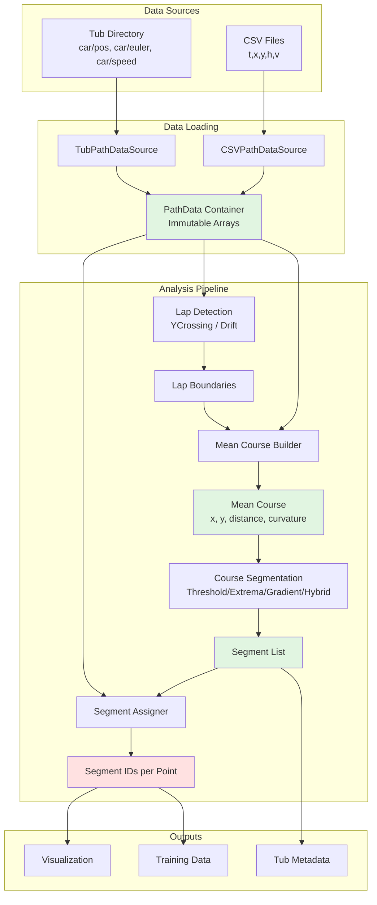
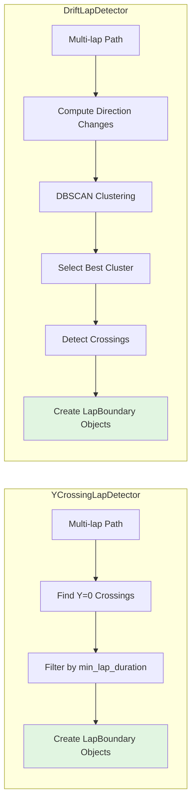
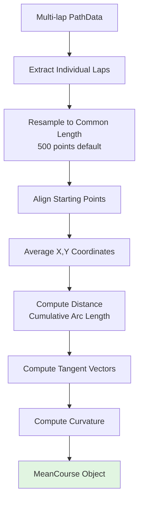
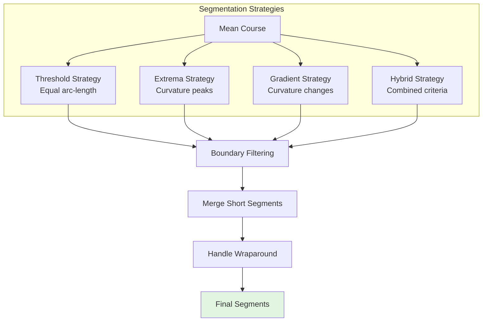
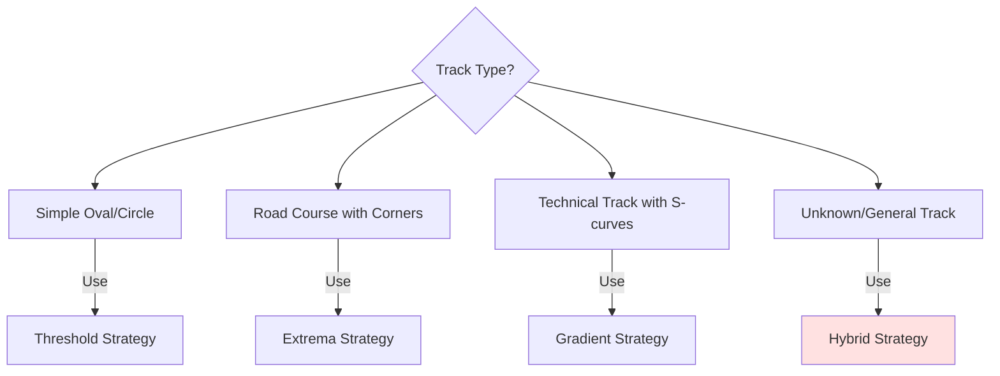
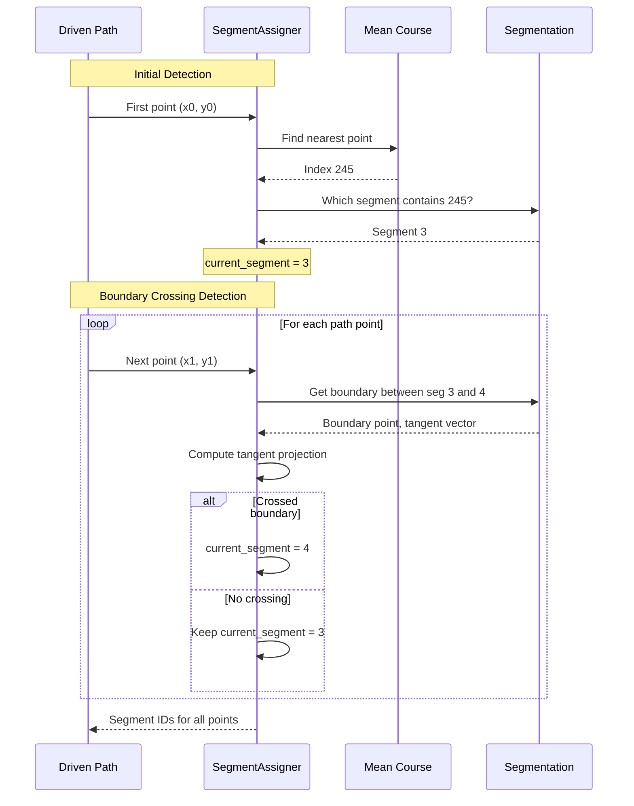

# Course Analysis Framework

A comprehensive course analysis system for analyzing recorded driving data and 
computing geometric track representations. This framework provides the 
foundational infrastructure for segment-based training and enables detailed 
analysis of vehicle trajectories and track characteristics.

**Location:** `donkeycar/course_analysis/`

## Design Philosophy

The course analysis framework is built on several key principles:
- **Immutability**: PathData containers use read-only numpy arrays to prevent 
  accidental modification
- **Strategy Pattern**: Pluggable algorithms for lap detection and segmentation
- **Pure Functions**: Stateless transformations for predictable behavior
- **Configuration Hierarchy**: Defaults → config file → explicit params
- **Testability**: All components work with synthetic data for unit testing

## Architecture Overview



## Key Components

### 1. Data Loading (`data_loader.py`)

#### PathData Container

An immutable data container that stores vehicle trajectory information with 
strict type safety and read-only guarantees.

```python
class PathData:
    """
    Immutable container for vehicle path data.
    
    All arrays are numpy.float64 with read-only flags set.
    """
    timestamp: np.ndarray  # Time in seconds
    x: np.ndarray         # X position in meters (right = positive)
    y: np.ndarray         # Y position in meters (forward = positive)
    heading: np.ndarray   # Heading in radians
    velocity: np.ndarray  # Speed in m/s
```

#### Data Sources

**1. CSVPathDataSource** - Loads from CSV files with format:
```csv
t,x,y,h,v
0.000,0.0,0.0,0.0,0.0
0.100,0.01,0.05,0.02,0.5
...
```
- `t`: timestamp (seconds)
- `x,y`: position in meters (IMU coordinate frame)
- `h`: heading in degrees (converted to radians internally)
- `v`: velocity in m/s

**2. TubPathDataSource** - Loads from tub directories:
- Extracts `_timestamp_ms` → converts to seconds
- Extracts `car/pos` → [x, y, z] (uses x, y only)
- Extracts `car/euler` → [roll, pitch, yaw] (uses yaw as heading)
- Extracts `car/speed` → velocity in m/s
- Handles missing fields gracefully with warnings
- Supports multi-session tubs (can load all sessions or specific one)

#### Validation

All data sources validate that:
- All arrays have identical lengths
- No NaN or Inf values present
- Timestamps are monotonically increasing
- Arrays have minimum length (configurable, default: 10 points)

---

### 2. Lap Detection (`lap_detection.py`)

Lap detection identifies where individual laps begin and end in multi-lap 
trajectory data. Two strategies handle different data quality scenarios.



#### LapBoundary Data Structure

```python
@dataclass
class LapBoundary:
    start_index: int    # Index where lap starts (inclusive)
    end_index: int      # Index where lap ends (inclusive)
    start_time: float   # Timestamp at start
    end_time: float     # Timestamp at end
    
    @property
    def duration(self) -> float:
        """Lap time in seconds"""
        
    @property
    def num_points(self) -> int:
        """Number of data points in lap"""
```

#### Strategy 1: YCrossingLapDetector

For clean, drift-free data.

**Algorithm:**
1. Find zero crossings: y[i] < 0 and y[i+1] >= 0
2. Filter crossings that are too close (< min_lap_duration)
3. Create LapBoundary for each valid crossing interval

**Configuration:**
```python
DEFAULT_PARAMS = {
    'min_lap_duration': 5.0,  # Minimum lap time (seconds)
    'y_threshold': 0.0,       # Y-axis crossing threshold
}
```

**Use Case:** Indoor tracks with RTK GPS or optical tracking, where position 
data is stable and repeatable. Works best when start/finish line crosses y=0 
axis perpendicular to travel direction.

#### Strategy 2: DriftLapDetector

For GPS data with drift.

**Algorithm:**
1. Calculate weighted averages of consecutive position windows
2. Find reversal points where weighted average direction changes
3. Use DBSCAN clustering to group similar reversal positions
4. Select most consistent cluster as lap start/finish location
5. Detect crossings through this clustered region

**Configuration:**
```python
DEFAULT_PARAMS = {
    'window_size': 50,          # Points to average for drift detection
    'min_lap_duration': 5.0,    # Minimum lap time
    'cluster_eps': 2.0,         # DBSCAN epsilon (meters)
    'cluster_min_samples': 2,   # DBSCAN minimum cluster size
}
```

**Use Case:** Outdoor tracks with consumer GPS where position measurements 
drift between laps. The clustering approach finds the "true" start/finish 
location despite measurement noise.

---

### 3. Mean Course Computation (`mean_course.py`)

Computes a reference "mean course" by aligning and averaging multiple laps. 
This creates a smooth, idealized representation of the track geometry.



#### MeanCourse Data Structure

```python
class MeanCourse:
    x: np.ndarray          # X coordinates (meters)
    y: np.ndarray          # Y coordinates (meters)
    distance: np.ndarray   # Cumulative distance (meters)
    curvature: np.ndarray  # Path curvature (1/meters)
    tangent_x: np.ndarray  # Unit tangent vector X
    tangent_y: np.ndarray  # Unit tangent vector Y
```

#### Algorithm Steps

1. **Extract Individual Laps:**
   - Use LapBoundary objects to slice PathData
   - Validate each lap has minimum points (default: 50)

2. **Resample to Common Length:**
   - Use linear interpolation to resample all laps to same number of points
   - Default: 500 points per lap (configurable)
   - Preserves geometric features while enabling averaging

3. **Align Laps:**
   - Align starting points by translating x,y coordinates
   - Optionally align heading angles
   - Ensures laps are in same coordinate frame

4. **Average Coordinates:**
   - Compute element-wise mean of x, y positions
   - Result: smooth trajectory through "average" of all laps

5. **Compute Derived Properties:**
   - **Distance**: Cumulative arc length along course
   - **Tangent vectors**: Normalized velocity direction
   - **Curvature**: Rate of heading change per distance

---

### 4. Course Segmentation (`segmentation.py`)

Divides the mean course into geometrically meaningful segments (straights, 
turns, transitions). Different strategies optimize for different track types.



#### Segment Data Structure

```python
@dataclass
class Segment:
    segment_id: int           # Unique identifier (0, 1, 2, ...)
    start_index: int          # Start index in mean course
    end_index: int            # End index in mean course
    start_distance: float     # Arc length at start (meters)
    end_distance: float       # Arc length at end (meters)
    mean_curvature: float     # Average curvature in segment
    max_curvature: float      # Maximum curvature in segment
    segment_type: SegmentType # STRAIGHT, LEFT_TURN, RIGHT_TURN, etc.
```

#### Segmentation Strategies

| Strategy | Method | Use Case | Pros | Cons |
|----------|--------|----------|------|------|
| **Threshold** | Equal arc-length | Oval tracks, simple courses | Predictable, easy | Ignores geometry |
| **Extrema** | Curvature peaks | Distinct corners | Natural features | May miss subtleties |
| **Gradient** | Curvature changes | S-curves, chicanes | Captures transitions | Sensitive to tuning |
| **Hybrid** | Combined criteria | General purpose | Robust, adaptive | More complex |

#### Choosing a Strategy



---

### 5. Segment Assignment (`segment_assignment.py`)

Assigns segment IDs to actual driven paths (which may deviate from mean 
course). Critical for training on segment-specific data.



#### Two-Stage Algorithm

**Stage 1: Initial Segment Detection**
- Find starting segment using nearest-neighbor to mean course
- Handles cases where driver starts anywhere on track, not just at segment 0

**Stage 2: Boundary Crossing Detection**
- Uses tangent projection method for robust crossing detection
- Works even when driver is left/right of ideal line
- Detects forward and backward boundary crossings
- Handles closed-loop wraparound (segment N → 0)

#### Why This Works

The tangent projection method is robust to cross-track errors:
- Driver can be left/right of ideal line
- As long as forward progress continues, boundaries detect correctly
- Handles wide racing lines and position drift

---

## Benefits

- **Geometric Understanding**: Quantify track features (straights, turns, difficulty)
- **Consistency Detection**: Compare lap variations, identify problem areas
- **Segment-Based Training**: Train on best instances of each track section
- **Data Quality**: Validate IMU data, detect position drift or errors
- **Performance Analysis**: Measure speed, smoothness per segment
- **Visualization**: Interactive tools for debugging and analysis
- **Reproducibility**: Metadata tracking ensures consistent results

---

## Example Usage

```python
from donkeycar.course_analysis import (
    TubPathDataSource,
    YCrossingLapDetector,
    MeanCourseBuilder,
    CourseSegmentation,
    SegmentAssigner
)

# 1. Load data
data_source = TubPathDataSource('./data/tub_1')
path_data = data_source.load()

# 2. Detect laps
detector = YCrossingLapDetector(params={'min_lap_duration': 8.0})
lap_boundaries = detector.detect_laps(path_data)

# 3. Build mean course from first 3 laps
builder = MeanCourseBuilder(params={'resample_points': 750})
mean_course = builder.build(path_data, lap_boundaries, num_laps=3)

# 4. Segment the course
segmentation = CourseSegmentation(
    mean_course=mean_course,
    strategy='hybrid',
    params={'min_segment_length': 2.0}
)
segmentation.compute()

# 5. Assign segments to full path
assigner = SegmentAssigner(segmentation)
segment_ids = assigner.assign(path_data.x, path_data.y)

print(f"Detected {len(lap_boundaries)} laps")
print(f"Course length: {mean_course.distance[-1]:.2f} m")
print(f"Created {segmentation.num_segments} segments")
```

---

[← Back to NEWS.md](NEWS.md)
