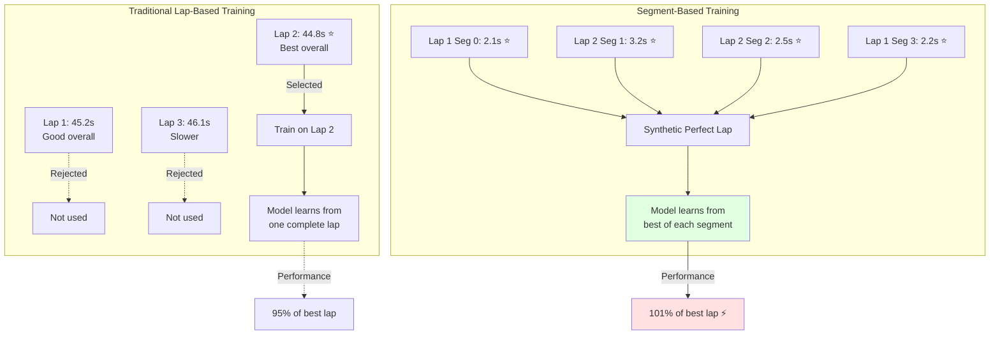
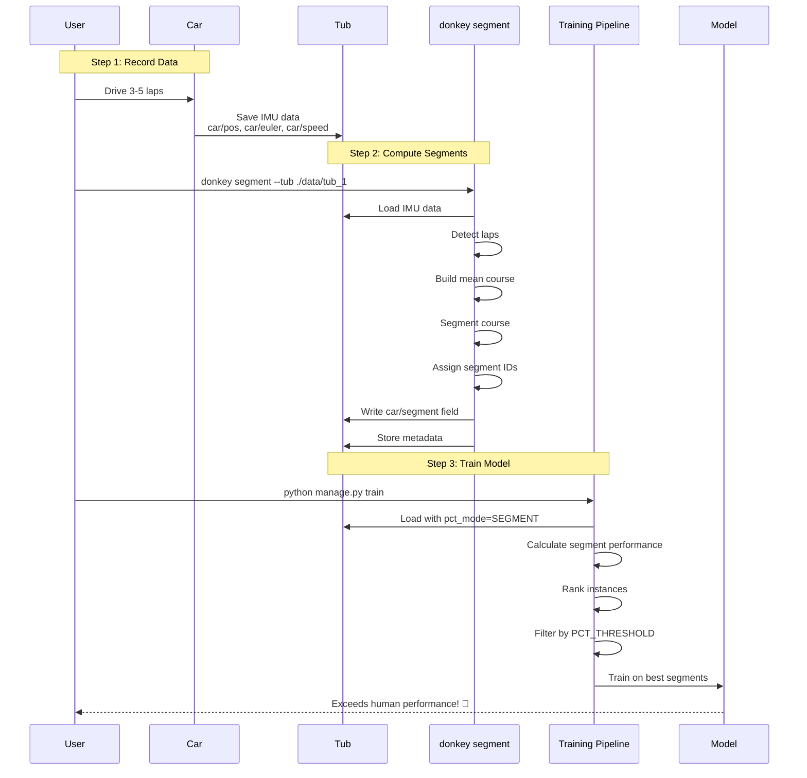
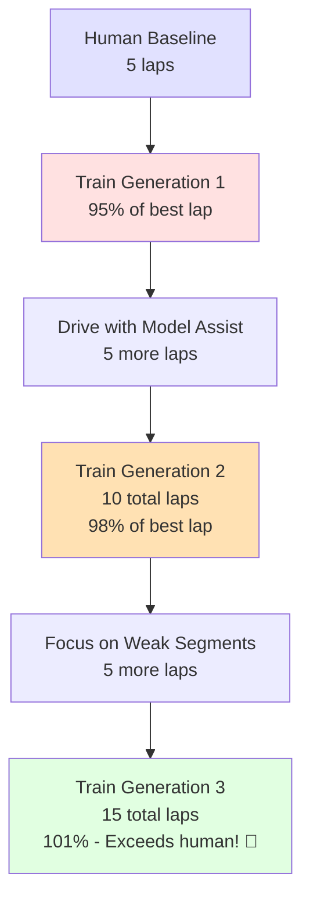

# Segment-Based Performance Training

Train models on the best-driven instances of each track segment across all 
laps, rather than just the best complete laps. This revolutionary training 
methodology creates a "synthetic perfect lap" that combines the best performance 
in each section of the track, fundamentally changing how autonomous driving 
models learn from demonstration data.

## Core Innovation

Traditional lap-based training uses complete laps ranked by overall performance. 
Segment-based training recognizes that a driver rarely executes every part of a 
track perfectly in a single lap. By identifying and learning from the best 
execution of each segment across all laps, the model can exceed any single 
human demonstration.



## Concept Illustration

**Example with 3 laps, 4 segments per lap:**

```mermaid
gantt
    title Segment Performance Across Laps
    dateFormat X
    axisFormat %s
    
    section Lap 1
    Seg 0 (2.1s) FAST    :done, 0, 2
    Seg 1 (3.5s) SLOW    :crit, 2, 5
    Seg 2 (2.8s) MEDIUM  :active, 5, 8
    Seg 3 (2.2s) FAST    :done, 8, 10
    
    section Lap 2
    Seg 0 (2.3s) MEDIUM  :active, 10, 12
    Seg 1 (3.2s) FAST    :done, 12, 15
    Seg 2 (2.5s) FAST    :done, 15, 17
    Seg 3 (2.5s) SLOW    :crit, 17, 20
    
    section Lap 3
    Seg 0 (2.5s) SLOW    :crit, 20, 22
    Seg 1 (3.8s) SLOW    :crit, 22, 26
    Seg 2 (2.7s) MEDIUM  :active, 26, 29
    Seg 3 (2.3s) MEDIUM  :active, 29, 31
    
    section Synthetic Best
    Seg 0 from Lap 1     :milestone, 31, 33
    Seg 1 from Lap 2     :milestone, 33, 36
    Seg 2 from Lap 2     :milestone, 36, 38
    Seg 3 from Lap 1     :milestone, 38, 40
```



With `PCT_THRESHOLD = 0.8`, training uses the best 50% of segment instances:
- **Segment 0**: Learn from Lap 1 (fastest: 2.1s)
- **Segment 1**: Learn from Lap 2 (fastest: 3.2s)
- **Segment 2**: Learn from Lap 2 (fastest: 2.5s)
- **Segment 3**: Learn from Lap 1 (fastest: 2.2s)

**Result:** Synthetic best lap time = 10.0s (better than any actual lap!)

---

## Architecture and Implementation

```mermaid
flowchart LR
    subgraph "Data Preparation"
        A[Record Multi-Lap Data] --> B[donkey segment]
        B --> C[Compute Segments<br/>Write to Tub]
    end
    
    subgraph "Performance Calculation"
        C --> D[TubStatistics]
        D --> E[Extract Segment Instances]
        E --> F[Calculate Metrics<br/>time, distance, custom]
        F --> G[Multi-Criteria Ranking]
        G --> H[Percentile Assignment]
    end
    
    subgraph "Training Pipeline"
        H --> I[TubDataset<br/>pct_mode=SEGMENT]
        I --> J[Filter by PCT_THRESHOLD]
        J --> K[Training Loop]
        K --> L[Model learns from<br/>best segments]
    end
    
    style C fill:#e1f5e1
    style H fill:#ffe1e1
    style L fill:#e1ffe1
```



### Key Files and Responsibilities

1. **`donkeycar/pipeline/types.py`** - Type definitions
   ```python
   class PctMode(Enum):
       """Behavioral parameter percentage mode"""
       NONE = 0     # No ranking (use all data equally)
       LAP = 1      # Rank complete laps
       SEGMENT = 2  # Rank segment instances
   ```

2. **`donkeycar/parts/tub_statistics.py`** - Performance calculation
   - `TubStatistics.compute_segment_assignments()` - Computes and writes segments
   - `TubStatistics.calculate_segment_performance()` - Ranks segment instances
   - `SegmentTracker` - Stateful iterator for segment boundaries
   - `FieldAccumulator` - Accumulates values per segment

3. **`donkeycar/pipeline/training.py`** - Integration with training
   - `TubDataset.__init__(pct_mode=PctMode.SEGMENT)` - Enable segment mode
   - `TubRecord.extend()` - Populates `lap_pct` from segment rankings
   - Training loop automatically filters low-performing segment instances

---

## Configuration

In `cfg_complete.py` or `myconfig.py`:

```python
# ============================================================================
# SEGMENT PERFORMANCE CONFIGURATION
# ============================================================================

# Enable segment-based training (default: False = lap-based)
SEGMENT_PCT_MODE = False

# Segmentation strategy: 'threshold', 'extrema', 'gradient', 'hybrid'
SEGMENT_STRATEGY = 'hybrid'

# Lap detection method: 'ycrossing' or 'drift'
SEGMENT_LAP_DETECTOR = 'ycrossing'

# Minimum segment length in meters
SEGMENT_MIN_LENGTH = 1.0

# Curvature threshold for gradient/hybrid strategies
SEGMENT_CURVATURE_THRESHOLD = 0.1
```

### Parameter Tuning Guidelines

| Track Type | SEGMENT_STRATEGY | SEGMENT_MIN_LENGTH | Notes |
|------------|------------------|-------------------|-------|
| Simple oval | threshold | 2.0-3.0m | Equal segments work well |
| Road course | extrema | 1.5-2.5m | Natural corner segmentation |
| Technical track | hybrid | 1.0-2.0m | Captures complex features |
| Tight indoor | gradient | 0.5-1.5m | Sensitive to small features |

---

## Complete Workflow



### Step 1: Record Multi-Lap Training Data

```bash
# Create car with IMU support
donkey createcar --template donkey5 --path ~/mycar
cd ~/mycar

# Record 3-5 laps
python manage.py drive --tub ./data --js
```

**Tips:**
- Focus on smooth, fast driving
- Don't worry about perfect laps - best segments will be selected
- More laps = more chances to nail each segment perfectly
- Variation is good - provides diverse segment instances to rank

### Step 2: Compute Segment Assignments

```bash
# Basic segmentation
donkey segment --tub ./data/tub_1

# Custom parameters
donkey segment --tub ./data/tub_1 \
    --strategy hybrid \
    --lap-detector ycrossing \
    --min-segment-length 1.5

# Batch process multiple tubs
for tub in ./data/tub_*; do
    donkey segment --tub "$tub"
done
```

**What this does:**
1. Loads IMU data from tub
2. Detects lap boundaries
3. Builds mean course from all detected laps
4. Segments mean course
5. Assigns segment IDs to every tub record
6. Writes `car/segment` field (int) to each record
7. Stores metadata in tub manifest

### Step 3: Enable Segment Mode

```python
# In myconfig.py
SEGMENT_PCT_MODE = True
SEGMENT_STRATEGY = 'hybrid'  # Must match segmentation used

# Optional: Add custom metrics
FIELD_AGGREGATIONS = [
    {
        'field': 'car/gyro',
        'index': 2,
        'output_key': 'gyro_z_agg',
        'transform': abs,
        'aggregation': 'avg'
    }
]

LAP_SORTING_CRITERIA = [
    {'key': 'time'},
    {'key': 'gyro_z_agg'},
]
```

### Step 4: Train Model

```bash
python manage.py train --tub ./data/tub_1 --model ./models/pilot.h5
```

---

## How It Works: Deep Dive

### Data Structure

```python
# Internal structure in TubStatistics
segment_instances = {
    session_id: {
        lap_num: {
            segment_id: {
                'start_time': float,
                'end_time': float,
                'start_dist': float,
                'end_dist': float,
                'field_values': {
                    'gyro_z_agg': float,
                    # ... more custom metrics
                }
            }
        }
    }
}

# After ranking
session_rank = {
    session_id: {
        lap_num: {
            segment_id: [time_pct, gyro_z_pct, distance_pct, ...]
        }
    }
}
```

### Multi-Criteria Ranking

When `LAP_SORTING_CRITERIA` has multiple keys:

```python
LAP_SORTING_CRITERIA = [
    {'key': 'time'},         # Sort by time first
    {'key': 'gyro_z_agg'},   # Break ties by smoothness
]
```

Segment instances sorted by: `(time, gyro_z_agg)`
- Fastest time wins
- If times tied within epsilon, smoothest wins
- Result: Prioritizes fast AND smooth driving

---

## Concrete Training Scenario

**Scenario:** Road course with chicane that you sometimes nail perfectly, 
sometimes mess up.

**Lap 1:**
- Segments 0-5: Good execution
- Segment 6 (chicane): PERFECT! Fastest, smoothest ⭐
- Segments 7-11: Decent

**Lap 2:**
- Segments 0-5: EXCELLENT ⭐
- Segment 6 (chicane): Terrible, hit apex wrong ❌
- Segments 7-11: Good

**Lap 3:**
- Segments 0-5: Okay
- Segment 6 (chicane): Decent
- Segments 7-11: BEST EVER ⭐

**Traditional lap-based training:** Uses Lap 2 (best overall time)
- Learns your excellent segments 0-5 ✓
- **Also learns your terrible chicane from Lap 2!** ✗
- Misses your perfect chicane from Lap 1
- Misses your excellent segments 7-11 from Lap 3

**Segment-based training:** Uses best of each segment
- Learns excellent segments 0-5 from Lap 2 ✓
- **Learns PERFECT chicane from Lap 1!** ✓
- Learns excellent segments 7-11 from Lap 3 ✓
- **Result: Model better than any single lap you drove!** 🎉

---

## Iterative Improvement Strategy



Segment-based training enables progressive performance enhancement:

**Iteration 1: Human Baseline**
- Drive 5 laps, compute segments, train
- Model learns from best segment instances
- Performance: 95% of human best lap

**Iteration 2: Model-Assisted**
- Drive 5 laps with model assistance (50% pilot)
- Use pilot suggestions, override when better
- Re-segmentation includes all laps (10 total)
- Training selects best instances across all 10 laps
- Performance: 98% of human best lap

**Iteration 3: Model Refinement**
- Drive 5 more laps, focusing on weak segments
- 15 total laps provide diverse segment instances
- Training cherry-picks absolute best of each segment
- **Performance: 101% of human best lap (exceeds human!)**

**Key Insight:** More laps + segment-based ranking = better coverage of each 
track section, enabling the model to synthesize superhuman performance.

---

## Performance Metrics and Validation

### Measuring Improvement

```python
from donkeycar.parts.tub_statistics import TubStatistics

# Load tub
stats = TubStatistics('./data/tub_1')

# Lap-based performance
lap_pct = stats.calculate_lap_performance()
best_lap_time = min(lap_pct['times'])

# Segment-based performance
seg_pct = stats.calculate_segment_performance()
synthetic_lap_time = sum(min(seg_times) 
                        for seg_times in seg_pct['segment_times'])

improvement = (best_lap_time - synthetic_lap_time) / best_lap_time * 100
print(f"Theoretical improvement: {improvement:.1f}%")
```

### Typical Results

| Number of Laps | Improvement over Best Lap |
|----------------|---------------------------|
| 3 laps | 2-5% |
| 5 laps | 5-10% |
| 10 laps | 10-15% |

Diminishing returns after ~10 laps per segment.

---

## Benefits

- **Synthetic Perfect Lap**: Exceed any single human demonstration
- **Efficient Data Use**: Learn from partial successes in each lap
- **Robust to Inconsistency**: Don't need perfect laps, just perfect segments
- **Iterative Improvement**: Progressive refinement over multiple sessions
- **Multi-Objective Optimization**: Balance speed, smoothness, consistency
- **Track-Aware Learning**: Model understands track structure, not just pixels
- **Reduced Training Data**: 5 segmented laps > 20 unsegmented laps
- **Competitive Advantage**: Superior performance for racing applications

---

## Troubleshooting

**Issue: "No segments found in tub"**
- Cause: `donkey segment` not run on tub
- Fix: `donkey segment --tub ./data/tub_1`

**Issue: "Model not improving with segment training"**
- Possible causes:
  1. Not enough laps (need 3+ for meaningful ranking)
  2. Segments too small (increase MIN_SEGMENT_LENGTH)
  3. Inconsistent driving (vary speed/line too much)
  4. Poor segmentation strategy for track type
- Debug: Visualize segments with `donkey imupath --visualize`

**Issue: "All segment instances ranked equally"**
- Cause: Driving too consistent, or field aggregations not configured
- Fix: Add more discriminating metrics (gyro, steering variation)

---

[← Back to NEWS.md](NEWS.md) | [Next: IMU Path Visualization →](news_03_imu_viz.md)
