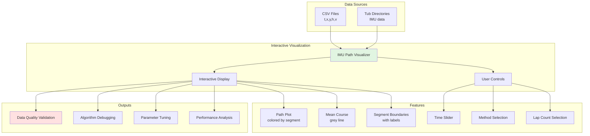
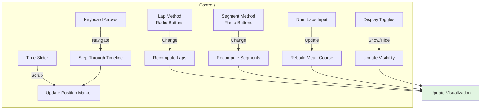
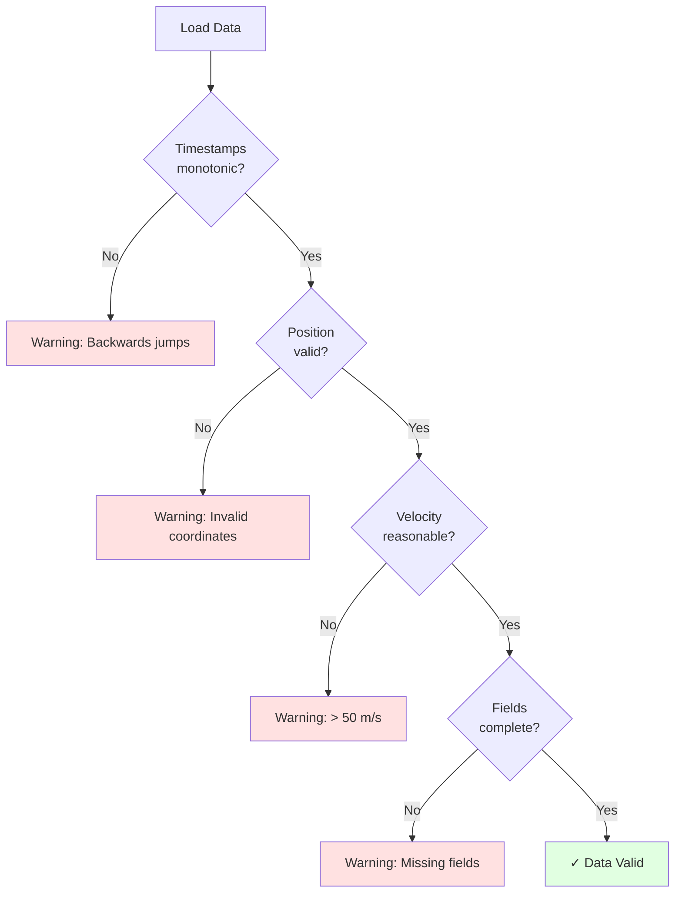
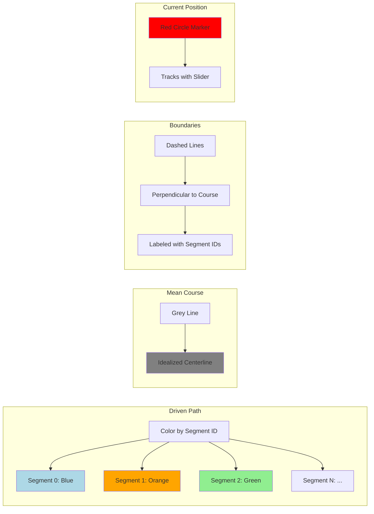
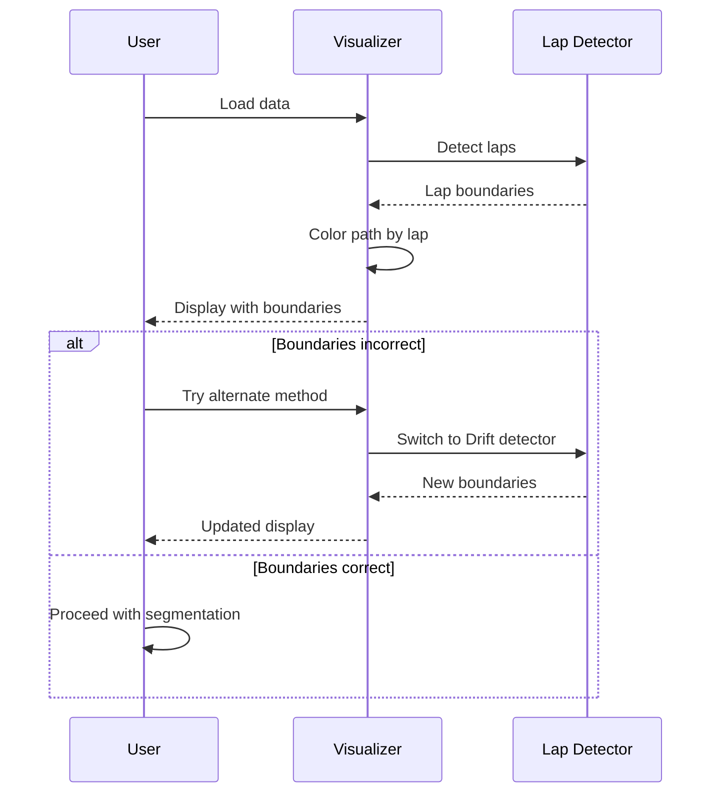
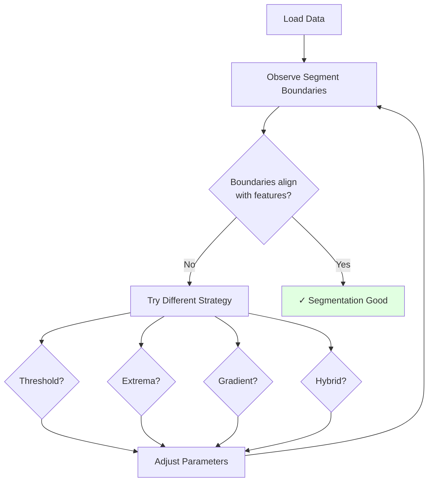
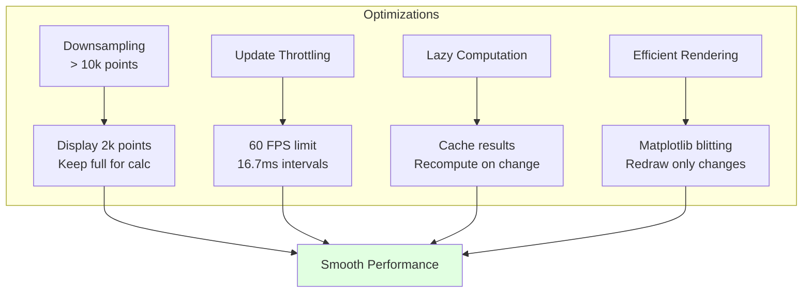

# IMU Path Visualization

Interactive visualization tool for analyzing recorded vehicle trajectories with 
real-time lap detection, course segmentation, and comprehensive debugging 
capabilities. This tool transforms raw IMU sensor data into actionable insights 
about driving performance and track geometry.

**Command:** `donkey imupath <data_source>`

**Location:** `donkeycar/utilities/interactive_imu_viz.py`

---

## Overview and Purpose

The IMU path visualizer serves multiple critical functions:



### Key Functions

1. **Data Quality Validation**: Verify IMU sensor data integrity before training
2. **Algorithm Debugging**: Visualize lap detection and segmentation behavior
3. **Parameter Tuning**: Experiment with different strategies and thresholds
4. **Performance Analysis**: Understand where driving can be improved
5. **Training Verification**: Confirm segment assignments match expectations

---

## User Interface

```
┌─────────────────────────────────────────────────────────┐
│  Track Visualization (Matplotlib Figure)                │
│                                                          │
│  ┌────────────────────────────────────────────────┐     │
│  │                                                 │     │
│  │           [Path Plot with Segments]            │     │
│  │                                                 │     │
│  │   • Driven path (colored by segment)           │     │
│  │   • Mean course (grey line)                    │     │
│  │   • Segment boundaries (vertical lines)        │     │
│  │   • Current position marker (red dot)          │     │
│  │   • Segment labels (S0, S1, S2...)             │     │
│  │                                                 │     │
│  └────────────────────────────────────────────────┘     │
│                                                          │
│  Time Slider: [────────●──────────────────────]          │
│                                                          │
│  Control Panel:                                          │
│  ┌─────────────┐  ┌──────────────┐  ┌──────────────┐   │
│  │ Lap Method  │  │  Seg Method  │  │  Num Laps    │   │
│  │ ○ YCrossing │  │  ○ Threshold │  │  [  3  ]     │   │
│  │ ● Drift     │  │  ○ Extrema   │  │  [ Update ]  │   │
│  │             │  │  ● Gradient  │  │              │   │
│  │             │  │  ○ Hybrid    │  │              │   │
│  └─────────────┘  └──────────────┘  └──────────────┘   │
│                                                          │
│  Status Panel:                                           │
│  Time: 12.34s | Speed: 1.23 m/s | Lap: 2 | Segment: 5  │
│  Position: (1.23, 4.56) | Heading: 45.6°               │
│                                                          │
└─────────────────────────────────────────────────────────┘
```

### Interactive Controls



1. **Time Slider**
   - Drag to scrub through recording
   - Click to jump to specific time
   - Updates position marker and status in real-time

2. **Lap Method Selector**
   - **YCrossing**: For clean, repeatable data
   - **Drift**: For GPS data with position drift
   - Changes trigger lap boundary recomputation

3. **Segmentation Method Selector**
   - **Threshold**: Equal arc-length segments
   - **Extrema**: Curvature peak-based
   - **Gradient**: Curvature change-based
   - **Hybrid**: Combined approach
   - Live update of segment boundaries and colors

4. **Num Laps Input**
   - Enter number of laps for mean course
   - Validates input (1 to total_laps)
   - Recomputes mean course and segments

5. **Keyboard Shortcuts**
   - `Left Arrow`: Step backwards (0.1 seconds)
   - `Right Arrow`: Step forwards (0.1 seconds)
   - `Home`: Jump to start
   - `End`: Jump to end

---

## Usage Examples

### Basic Visualization

```bash
# Visualize CSV file
donkey imupath ./recordings/track_session_001.csv

# Visualize tub directory
donkey imupath ./data/tub_1

# Visualize specific tub session
donkey imupath ./data/tub_1 --session 20240115_143022
```

### Advanced Options

```bash
# Specify lap detection method
donkey imupath --lap-method drift ./outdoor_gps_data.csv

# Specify segmentation strategy
donkey imupath --segment-method hybrid ./data/tub_1

# Set number of laps for mean course
donkey imupath --num-laps 3 ./data/tub_1

# Combine options
donkey imupath \
    --lap-method drift \
    --segment-method extrema \
    --num-laps 4 \
    --min-segment-length 2.0 \
    ./outdoor_track.csv
```

---

## Data Sources and Formats

### CSV Format

```csv
t,x,y,h,v
0.000,0.000,0.000,0.000,0.000
0.100,0.015,0.048,0.523,0.502
0.200,0.032,0.095,0.589,0.498
...
```

**Field Definitions:**
- `t`: Timestamp in seconds (relative to recording start)
- `x`: X position in meters (right = positive, local coordinate frame)
- `y`: Y position in meters (forward = positive, local coordinate frame)
- `h`: Heading in degrees (0 = north, clockwise positive)
- `v`: Velocity in meters per second

### Tub Format

The visualizer automatically extracts required fields from tub records:

```python
# Field mapping from tub to PathData
_timestamp_ms    → timestamp (converted to seconds)
car/pos[0:2]     → x, y (position in meters)
car/euler[2]     → heading (yaw angle in radians)
car/speed        → velocity (m/s)
```

### Data Quality Checks



---

## Visualization Elements

### Path Display



### Status Panel Information

- **Time**: Current timestamp (seconds from start)
- **Speed**: Instantaneous velocity (m/s)
- **Lap**: Current lap number (0-indexed)
- **Segment**: Current segment ID
- **Position**: (x, y) coordinates in meters
- **Heading**: Current heading angle (degrees)

---

## Debugging Workflows

### Workflow 1: Validate Lap Detection



1. Load data: `donkey imupath ./data/tub_1`
2. Observe lap boundaries (where path colors change)
3. Verify boundaries align with actual lap start/finish
4. If incorrect:
   - Try alternate lap method (YCrossing ↔ Drift)
   - Check data quality (gaps, jumps)
   - Adjust min_lap_duration parameter

### Workflow 2: Tune Segmentation



1. Load with specific method: `donkey imupath --segment-method hybrid ./data/tub_1`
2. Observe segment boundaries on track
3. Check if boundaries align with geometric features
4. Experiment with strategies and parameters
5. Adjust `min_segment_length` or `curvature_threshold` as needed

### Workflow 3: Verify Training Data Quality

1. Load training tub: `donkey imupath ./data/training_tub_1`
2. Scrub through time slider, watching for:
   - Position jumps (sensor errors)
   - Velocity spikes (noise)
   - Heading inconsistencies (IMU drift)
3. Identify problematic sections
4. Optionally exclude from training

---

## Performance Optimizations



- **Downsampling**: Large datasets (> 10,000 points) displayed at 2,000 points
- **Update Throttling**: Slider updates limited to 60 FPS
- **Lazy Computation**: Mean course and segments computed on demand, cached
- **Efficient Rendering**: Uses matplotlib blitting for animated elements

---

## Output and Export

### Screenshot Capture

Use matplotlib toolbar "Save" button:
- Formats: PNG, PDF, SVG
- Recommended: PNG at 300 DPI for documentation

### Data Export

```python
from donkeycar.utilities.interactive_imu_viz import export_segment_data

export_segment_data(
    path_data=visualizer.path_data,
    segment_ids=visualizer.segment_ids,
    output_path='./analyzed_path.csv'
)

# Output format: t, x, y, h, v, lap, segment
```

### Session Summary

```bash
# Generate summary report
donkey imupath ./data/tub_1 --summary > session_report.txt

# Report includes:
# - Total recording time
# - Number of laps detected
# - Lap times and statistics
# - Number of segments per lap
# - Mean course length
# - Curvature statistics
# - Data quality metrics
```

---

## Troubleshooting

**Issue: "No laps detected"**
- **Solutions**:
  1. Try alternate lap_method
  2. Check if track crosses y=0 (for YCrossing)
  3. Reduce min_lap_duration
  4. Verify data has multiple laps

**Issue: "Visualization is slow"**
- **Solutions**:
  1. Downsample before visualization
  2. Use --max-points flag to limit display
  3. Disable real-time segment updates
  4. Close other applications

**Issue: "Segments don't match track features"**
- **Solutions**:
  1. Try different segmentation strategy
  2. Adjust min_segment_length (increase if too many small segments)
  3. Adjust curvature_threshold
  4. Visualize curvature plot to understand track geometry

---

## Benefits

- **Visual Debugging**: See exactly what algorithms are doing
- **Interactive Exploration**: Experiment with parameters in real-time
- **Data Validation**: Catch sensor errors before training
- **Parameter Tuning**: Find optimal settings for your track
- **Performance Analysis**: Identify improvement opportunities
- **Documentation**: Generate visualizations for reports
- **Training Verification**: Confirm segment assignments are correct

---

[← Back to NEWS.md](NEWS.md) | [Previous: Segment Training ←](news_02_segment_training.md) | [Next: Field Aggregations →](news_04_field_aggregations.md)
