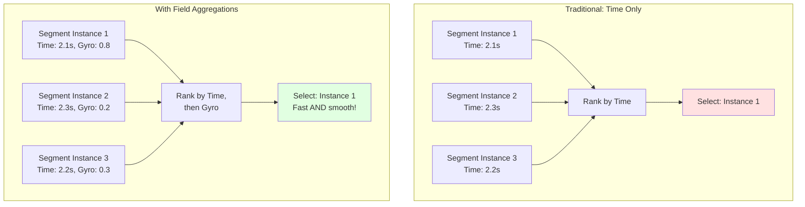
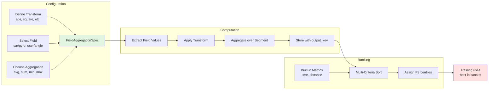
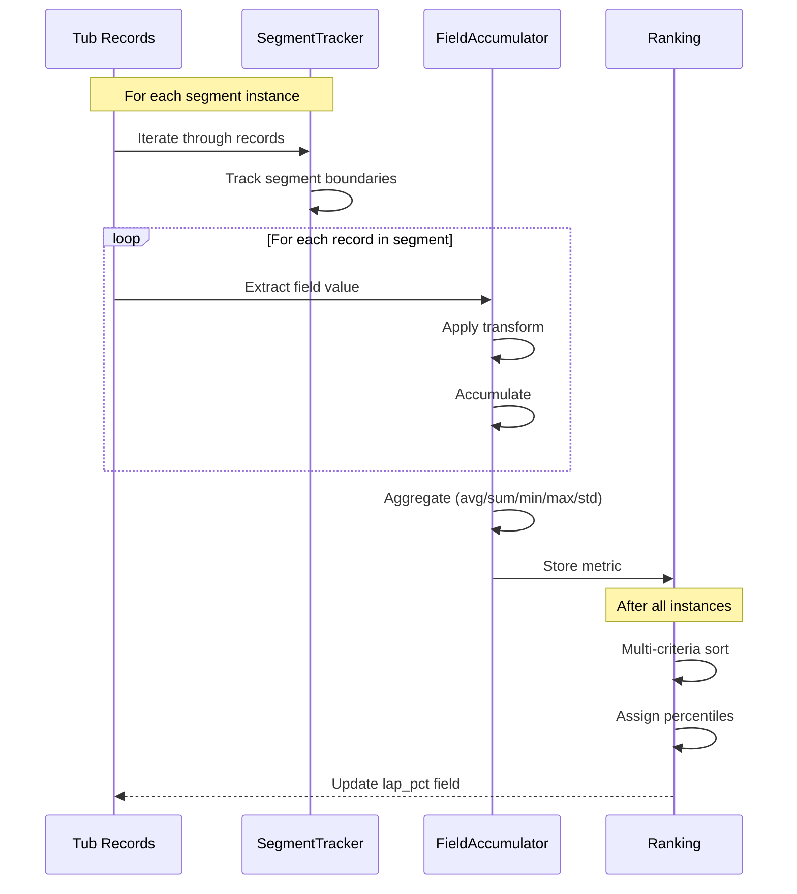

# Field Aggregations - Custom Performance Metrics

Field aggregations enable multi-objective optimization during segment-based training by allowing custom metrics beyond simple lap time. This powerful feature lets you define what "best" means for your specific application - whether that's smoothness, energy efficiency, consistency, or any combination of factors.

## Concept



## Architecture



## Configuration

### Basic Setup

```python
# In myconfig.py

def abs_transform(value):
    """Absolute value - direction-independent magnitude"""
    return abs(value)

FIELD_AGGREGATIONS = [
    {
        'field': 'car/gyro',           # Tub field name
        'index': 2,                     # Array index (z-axis = yaw rate)
        'output_key': 'gyro_z_agg',    # Key in performance dict
        'transform': abs_transform,     # Transform before aggregation
        'aggregation': 'avg'            # Aggregation method
    }
]

LAP_SORTING_CRITERIA = [
    {'key': 'time'},         # Primary: fastest
    {'key': 'gyro_z_agg'},   # Secondary: smoothest
]
```

### Aggregation Methods

| Method | Description | Use Case |
|--------|-------------|----------|
| `avg` | Mean value | Typical behavior, smoothness |
| `sum` | Total accumulation | Energy consumption, penalties |
| `min` | Worst-case metric | Safety margins, clearances |
| `max` | Peak value | Maximum effort, extremes |
| `median` | Robust central tendency | Outlier-resistant metrics |
| `std` | Variability | Consistency, stability |

## Example Use Cases

### Example 1: Fast + Smooth Driving

Goal: Prioritize speed, but prefer smoother driving when times are similar.

```python
FIELD_AGGREGATIONS = [
    {
        'field': 'car/gyro',
        'index': 2,
        'output_key': 'gyro_z_agg',
        'transform': abs,
        'aggregation': 'avg'
    }
]

LAP_SORTING_CRITERIA = [
    {'key': 'time'},         # Fast first
    {'key': 'gyro_z_agg'},   # Then smooth
]
```

### Example 2: Competition with Penalties

Goal: Avoid boundary violations, then minimize time.

```python
def boundary_penalty(distance):
    """Exponential penalty for close approaches"""
    if distance < 0.5:
        return 10.0  # Heavy penalty
    return max(0, 1.0 - distance)

FIELD_AGGREGATIONS = [
    {
        'field': 'car/boundary_distance',
        'index': None,
        'output_key': 'boundary_penalty',
        'transform': boundary_penalty,
        'aggregation': 'sum'
    },
    {
        'field': 'user/throttle',
        'index': None,
        'output_key': 'avg_throttle',
        'transform': lambda x: x,
        'aggregation': 'avg'
    },
]

LAP_SORTING_CRITERIA = [
    {'key': 'boundary_penalty'},  # Clean first!
    {'key': 'time'},              # Then fast
    {'key': 'avg_throttle'},      # Prefer aggressive
]
```

### Example 3: Consistent Steering

Goal: Prefer smooth, predictable steering.

```python
FIELD_AGGREGATIONS = [
    {
        'field': 'user/angle',
        'index': None,
        'output_key': 'steering_consistency',
        'transform': lambda x: x,
        'aggregation': 'std'  # Lower std = more consistent
    },
    {
        'field': 'user/angle',
        'index': None,
        'output_key': 'max_steering',
        'transform': abs,
        'aggregation': 'max'
    },
]

LAP_SORTING_CRITERIA = [
    {'key': 'time'},
    {'key': 'steering_consistency'},  # Smooth steering
    {'key': 'max_steering'},          # Limited peak angles
]
```

### Example 4: Energy Efficiency

Goal: Balance speed with energy consumption.

```python
def throttle_energy(throttle):
    """Energy proportional to throttle^2"""
    return throttle ** 2

FIELD_AGGREGATIONS = [
    {
        'field': 'user/throttle',
        'index': None,
        'output_key': 'energy_consumption',
        'transform': throttle_energy,
        'aggregation': 'sum'
    },
]

LAP_SORTING_CRITERIA = [
    {'key': 'time'},                # Fast
    {'key': 'energy_consumption'},  # Efficient
]
```

## How It Works

### Data Flow



### Multi-Criteria Sorting Example

```python
# Three segment instances with metrics
instances = [
    {'time': 2.1, 'gyro_z_agg': 0.5},  # Fast, jerky
    {'time': 2.3, 'gyro_z_agg': 0.2},  # Slow, smooth
    {'time': 2.2, 'gyro_z_agg': 0.3},  # Medium, smooth
]

LAP_SORTING_CRITERIA = [
    {'key': 'time'},
    {'key': 'gyro_z_agg'},
]

# After sorting by (time, gyro_z_agg)
# Rank 0: Instance 0 (2.1, 0.5) → lap_pct = 0.0 (best)
# Rank 1: Instance 2 (2.2, 0.3) → lap_pct = 0.5
# Rank 2: Instance 1 (2.3, 0.2) → lap_pct = 1.0 (worst)

# With PCT_THRESHOLD = 0.8, train on instances 0 and 2
```

## Validation and Debugging

### Complete End-to-End Workflow

```bash
# 1. Record training data with custom sensor fields
cd ~/mycar
python manage.py drive --tub ./data

# 2. Configure field aggregations in myconfig.py
cat >> myconfig.py << 'EOF'

# Field aggregations for multi-objective optimization
FIELD_AGGREGATIONS = [
    {
        'field': 'car/gyro',
        'index': 2,
        'output_key': 'gyro_z_agg',
        'transform': abs,
        'aggregation': 'avg'
    }
]

LAP_SORTING_CRITERIA = [
    {'key': 'time'},
    {'key': 'gyro_z_agg'},
]
EOF

# 3. Compute segments with field aggregations
donkey segment --tub ./data/tub_1 --config myconfig.py

# 4. Verify metrics were calculated
python -c "
from donkeycar.parts.tub_v2 import Tub
from donkeycar.parts.tub_statistics import TubStatistics
from donkeycar.config import Config

cfg = Config()
tub = Tub('./data/tub_1')
stats = TubStatistics(tub, cfg)
perf = stats.calculate_segment_performance()
print('Metrics available:', list(perf[list(perf.keys())[0]][0][0].keys()))
"

# 5. Train with segment-based performance
python manage.py train --tub ./data/tub_1
```

### Verify Metrics

```python
from donkeycar.parts.tub_v2 import Tub
from donkeycar.parts.tub_statistics import TubStatistics

tub = Tub('./data/tub_1')
stats = TubStatistics(tub, cfg)

# Calculate performance
performance = stats.calculate_segment_performance()

# Inspect metrics
session_id = list(performance.keys())[0]
metrics = performance[session_id][0][0]  # Lap 0, Segment 0

for key, value in metrics.items():
    print(f"{key}: {value:.4f}")

# Expected output:
#   time: 2.1234
#   distance: 3.4567
#   gyro_z_agg: 0.5678
```

### Visualize Distributions

```python
import matplotlib.pyplot as plt

# Collect metrics across instances
all_times = []
all_gyro = []

for session in performance.values():
    for lap in session.values():
        for segment in lap.values():
            all_times.append(segment['time'])
            all_gyro.append(segment['gyro_z_agg'])

# Plot distributions
fig, (ax1, ax2) = plt.subplots(1, 2, figsize=(12, 4))

ax1.hist(all_times, bins=20)
ax1.set_xlabel('Segment Time (s)')
ax1.set_title('Time Distribution')

ax2.hist(all_gyro, bins=20)
ax2.set_xlabel('Avg Abs Gyro Z')
ax2.set_title('Smoothness Distribution')

plt.savefig('metric_distributions.png')
```

## Benefits

- **Multi-Objective Optimization**: Balance multiple performance goals
- **Domain-Specific Metrics**: Customize for competition rules or preferences
- **Flexible Configuration**: Change metrics without code changes
- **Behavioral Shaping**: Encourage desired driving characteristics
- **Competitive Advantage**: Optimize beyond simple lap time
- **Extensible Framework**: Easy to add new metrics and transforms
- **Data-Driven Insights**: Quantify driving quality objectively

---

[← Back to NEWS.md](NEWS.md) | [Previous: IMU Visualization ←](news_03_imu_viz.md)
